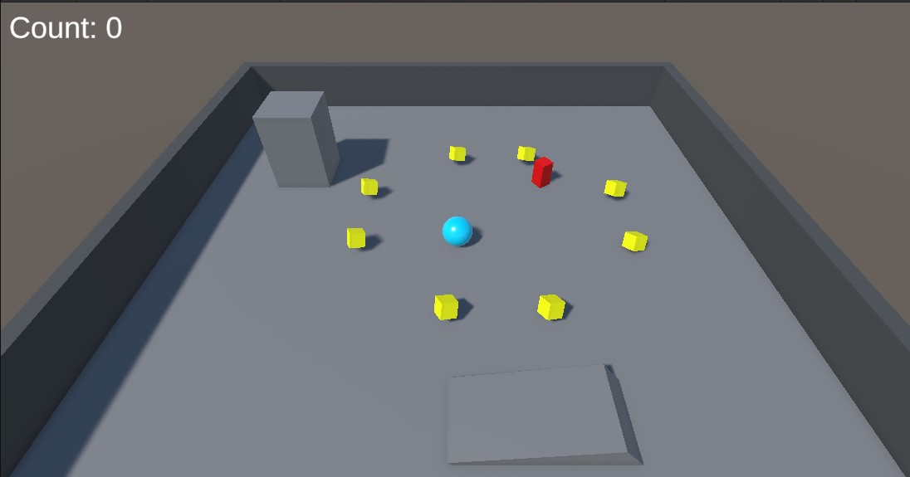
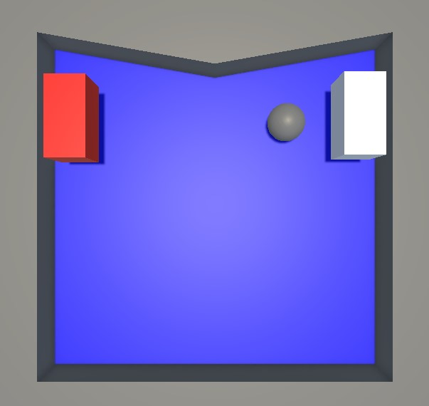
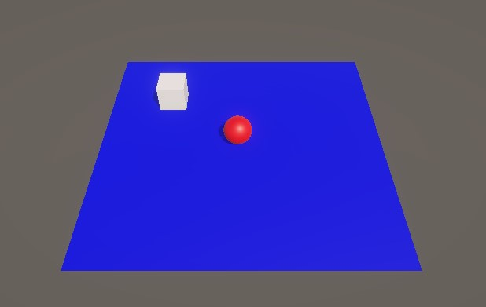

# Improve-Unity-Skills
 Small Projects to develope a better Unity understanding

## Roll a Ball
Flee of the red AI enemy and collect the yellow items

## Pong 3d
Beat the white bot by getting the ball to the wall behind him

## ML-Agents Tutorial
The goal is to programm a ml-agent who controlls the red ball. The agent should maximize the reward who he gets by collecting the white blocks without falling off the plane.
